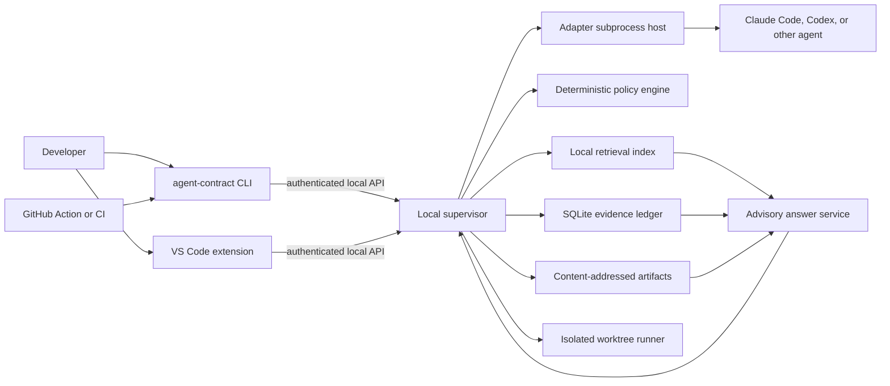
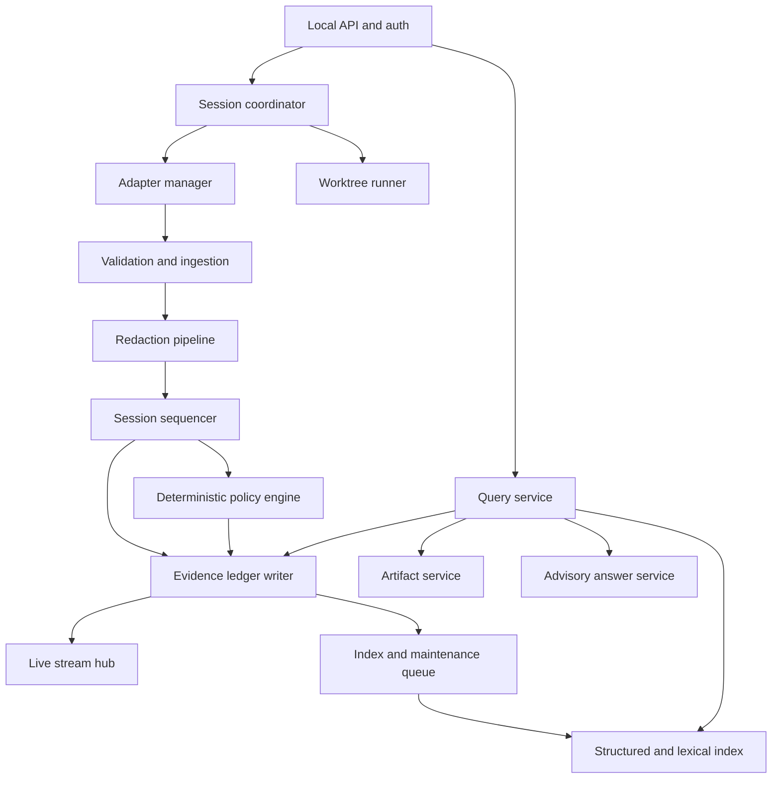

# Local-First CLI and Supervisor Architecture

- Status: proposed target architecture
- Date: 2026-09-11
- Scope: installable CLI, local supervisor, live evidence, historical investigation, deterministic findings, and evidence-grounded retrieval

## Executive decision

The first backend-complete product surface will be an installable command-line client named `agent-contract`. It will provide live run output, session history, structured investigation, findings, and evidence retrieval. The CLI does not own collection, policy, or durable state. It is a client of the same local supervisor used by the VS Code extension and, later, CI.

VS Code remains the primary daily developer interface. Building the CLI first gives the supervisor a narrow reference client and makes every backend capability independently testable before it is rendered in the extension.

The local supervisor is the only trusted application component. It owns:

- Agent and adapter process lifecycle.
- Canonical event ordering and capability snapshots.
- Redaction before persistence, indexing, export, or upload.
- Deterministic policy evaluation and contract verdicts.
- Durable local evidence and content-addressed artifacts.
- Live event fan-out, historical queries, and evidence retrieval.
- Isolated worktree orchestration for contract runs.

Retrieval and language models are read-only, advisory consumers of retained evidence. They cannot create or override a policy decision, contract verdict, evidence grade, approval, or enforcement result.

## Product workflows

The architecture must support five connected but distinct workflows.

### Monitor a live run

A developer starts or attaches to a supported coding agent. The terminal shows normalized events as they are committed: instructions, messages exposed by the adapter, tool calls, commands, file effects, tests, policy decisions, evidence gaps, and process status. Raw terminal I/O may be relayed for an interactive agent, but only redacted normalized data is durable.

### Reconstruct what happened

A developer can inspect a session by sequence, time, turn, tool call, command, path, test, subagent, policy rule, or correlation ID. Supervisor-assigned sequence is authoritative. Vendor timestamps are retained only as source metadata.

### Flag policy and evidence issues

Versioned deterministic rules produce immutable decisions. The UI projects actionable failures, denials, approval requirements, integrity problems, truncation, and evidence gaps as findings. Unsupported vendor visibility produces `unknown`, never an inferred pass or fail.

### Ask workflow questions

A developer can ask questions such as:

- What changed immediately before the test failed?
- Which command touched `infra/production`?
- Did the agent load the applicable instructions?
- Why was this action denied?
- Which evidence is missing for this contract assertion?

The query path first applies deterministic filters and correlation expansion. An optional answer generator may summarize the retrieved content, but every factual statement must cite retained evidence. Insufficient evidence is reported as a gap.

### Run repeatable contracts

A fixture task runs against a pinned repository snapshot in an isolated worktree. The supervisor evaluates path, command, test, tool, instruction, and evidence assertions and emits `pass`, `fail`, or `unknown` with exact evidence references.

## Non-negotiable invariants

1. The extension and CLI are clients, not trust boundaries.
2. Repository instructions, contracts, tool output, and agent output are untrusted input.
3. Hard decisions are deterministic, versioned, and reproducible from retained inputs.
4. Evidence grades are preserved end to end: `observed-native`, `observed-boundary`, `computed`, `model-declared`, and `unknown`.
5. Missing, redacted, truncated, ambiguous, or unsupported evidence cannot become a guessed pass or fail.
6. Raw sensitive data is not written and then redacted later. Redaction precedes durable storage and indexing.
7. Upload and remote model use are disabled by default and require explicit user-local opt-in.
8. A client sees an event only after the event or its explicit transient form has a defined durability state.
9. Retrieval cannot execute tools, approve actions, mutate findings, or change policy state.
10. A monitored feature is not exposed as implemented until it reaches real supervisor behavior.

## System context



## Runtime topology

### Installation unit

The initial distribution is a TypeScript/Node.js package that installs the `agent-contract` executable and a version-matched supervisor entry point. The npm package name is a publishing decision; the executable name is the stable user contract.

The CLI and supervisor ship together initially to prevent protocol skew. They remain separate processes and package boundaries. A standalone signed executable can replace the Node.js distribution later without changing the protocol or evidence format.

### Per-user supervisor

One supervisor instance runs per operating-system user and execution environment. It can manage multiple repositories and concurrent sessions. It is never a machine-wide privileged service.

The supervisor uses a process lock and instance record to prevent duplicate writers. The record contains only process ID, instance ID, protocol version, transport location, start time, and executable version. Stale records are detected by transport connection plus process liveness, not by PID alone.

Startup is serialized by an operating-system lock acquired before binding the endpoint or opening the evidence store for writes. On Unix this is an advisory file lock in the user-local runtime directory; on Windows it is a user-scoped named mutex or equivalent. If a second process loses the lock race, it connects to the recorded endpoint and verifies the live instance ID. Only a process holding the exclusive lock can remove a stale instance record or endpoint. A PID match alone is never sufficient because operating systems reuse PIDs.

The v0 lifecycle is explicit:

- `agent-contract supervisor start` starts it after user intent.
- A run command may offer to start it because the command itself is explicit intent.
- `agent-contract supervisor start --foreground` is the development and diagnostic mode.
- Automatic login startup is a later opt-in service-manager feature.
- The VS Code extension starts or connects only after a user command and workspace-trust check.

### Execution-location rule

The supervisor must run where the repository and agent execute. In SSH, dev containers, and Codespaces, that means the remote execution environment. The UI must not silently transfer repository evidence to a supervisor on another machine.

### Run modes

Every session records one immutable run mode:

| Mode | Purpose | Isolation | Enforcement claim |
| --- | --- | --- | --- |
| `observe` | Attach to or import an existing workflow. | None guaranteed. | Post-action findings only unless the adapter proves interception. |
| `managed` | Supervisor launches the adapter and agent. | Current workspace or explicit worktree. | Capability-dependent pre-action decisions. |
| `contract` | Reproducible fixture evaluation. | Pinned isolated worktree by default. | Deterministic assertion result with unknown for gaps. |

The product never describes `observe` as sandboxed or preventive.

### Workspace trust outside VS Code

Historical reads do not execute workspace code and need no workspace trust. Scanning repository files, launching an agent, running a command, or creating a fixture worktree requires explicit CLI trust.

The supervisor owns one shared user-local trust registry keyed by canonical workspace path and repository identity. The CLI manages this registry; the extension cannot bypass it. Commands include:

```text
agent-contract workspace trust <path>
agent-contract workspace untrust <path>
agent-contract workspace status <path>
```

Interactive run commands can prompt once. Non-interactive runs require an explicit command-line trust assertion or a pre-existing user-local trust record. Repository configuration cannot grant trust to itself.

VS Code workspace trust and supervisor workspace trust are conjunctive gates. The extension refuses an execution request when `vscode.workspace.isTrusted` is false; after that check, the supervisor independently requires its own trust record or an explicit user-approved grant. The CLI cannot override VS Code trust for an extension-originated request, and VS Code trust cannot implicitly trust the workspace for CLI execution. Organization policy may deny execution regardless of either client gate.

## Repository package boundaries

The target monorepo structure is:

```text
apps/
  cli/                       Terminal UX and supervisor client
  local-supervisor/          Trusted runtime and API host
  vscode-extension/          Primary daily UI
packages/
  event-schema/              Versioned wire and persistence schemas
  supervisor-protocol/       Client, API contracts, cursors, errors
  adapter-sdk/               Capability and adapter subprocess protocol
  evidence-store/            SQLite ledger and artifact store
  policy-engine/             Pure deterministic compiler/evaluator
  redaction/                 Structured omission and secret redaction
  retrieval/                 Structured query and advisory retrieval
  config/                    Typed config loading and precedence
  test-kit/                  Fixtures, fake clock, conformance helpers
adapters/
  claude-code/               First deep vendor adapter
  codex/                     Second deep vendor adapter
fixtures/
  repositories/              Isolated behavioral fixtures
```

Package dependency direction is one way:

```text
event-schema
    ^
    +-- supervisor-protocol
    +-- adapter-sdk
    +-- evidence-store
    +-- policy-engine
  +-- redaction
    +-- retrieval
             ^
             |
      local-supervisor
          ^       ^
          |       |
         CLI   VS Code
```

No package can import from an application. The schema package has no dependency on VS Code, a vendor SDK, SQLite, or an LLM provider.

## CLI contract

### Command groups

| Command | Responsibility |
| --- | --- |
| `agent-contract doctor` | Check installation, protocol compatibility, storage, permissions, adapters, and optional dependencies. |
| `agent-contract supervisor start|status|stop` | Explicit local supervisor lifecycle. |
| `agent-contract workspace trust|untrust|status` | Manage user-local execution trust. |
| `agent-contract run` | Start a managed agent session through the supervisor. |
| `agent-contract observe` | Attach or import where an adapter supports it. |
| `agent-contract watch [session]` | Follow committed normalized events and findings. |
| `agent-contract sessions list|show` | Inspect session identity, state, capabilities, and evidence completeness. |
| `agent-contract timeline <session>` | Reconstruct ordered activity with correlation expansion. |
| `agent-contract events query` | Apply exact filters over retained canonical events. |
| `agent-contract findings list|show|ack` | Inspect deterministic issues and evidence gaps. |
| `agent-contract show <reference>` | Resolve an event, finding, decision, artifact, rule, or contract reference. |
| `agent-contract ask` | Produce an evidence-cited advisory answer. |
| `agent-contract instructions resolve` | Show effective instruction sources and provenance for a target path. |
| `agent-contract contract run` | Run a fixture in isolation and emit a verdict. |
| `agent-contract export|verify` | Create or verify a portable redacted evidence bundle. |
| `agent-contract retention status|prune` | Inspect and explicitly apply local retention. |

Commands are added only with a real backend path. Early releases expose fewer commands rather than placeholders.

### Output conventions

- `pretty` is the default only when stdout is a TTY.
- `--format json` emits one versioned result object.
- `--format jsonl` emits one versioned object per line for streams.
- Data goes to stdout. Client diagnostics and progress go to stderr.
- ANSI styling is disabled when output is redirected or `NO_COLOR` is set.
- Timestamps default to local display but machine formats always use UTC RFC 3339.
- Paths display workspace-relative where possible. Absolute paths require an explicit detail view.
- Secret placeholders remain placeholders; `--raw` never bypasses durable redaction.

A live row should contain stable, scannable fields:

```text
SEQ  TIME          LEVEL  ACTOR      KIND                SUBJECT                 GRADE
42   14:03:21.184  info   claude     command.started     npm test                observed-native
43   14:03:21.212  warn   supervisor policy.decision     deny-production-edit    computed
44   14:03:22.004  info   boundary   test.completed      extension.test.ts       observed-boundary
```

### Live streams

`watch` consumes the committed event stream. It can filter by event kind, evidence grade, actor, path, command, finding severity, turn, and correlation ID. A reconnect resumes after the last committed session sequence.

Interactive terminal bytes use a separate transient full-duplex channel. This distinction prevents terminal flow control from delaying evidence persistence and prevents an ANSI byte stream from becoming the canonical audit model.

### Exit semantics

For contract and check commands:

| Exit | Meaning |
| --- | --- |
| `0` | Operation completed and required assertions passed. |
| `2` | A deterministic policy or contract assertion failed. |
| `3` | The required result is unknown or evidence is incomplete. |
| `4` | Invalid invocation, configuration, or missing user approval. |
| `5` | Supervisor, adapter, or protocol unavailable/incompatible. |
| `6` | Integrity, migration, or internal operational failure. |

Managed interactive runs report both the child exit and Agent Contract Lab result. They preserve the child exit by default; `--fail-on finding` and `--fail-on unknown` provide explicit automation behavior.

## Supervisor internal architecture



### API and authentication gateway

The gateway terminates local transport, validates the installation credential, negotiates protocol versions, enforces request limits, assigns request IDs, and maps domain errors to stable error objects. It does not contain policy logic.

### Session coordinator

The coordinator owns the session state machine, immutable run metadata, workspace lease, adapter instance, cancellation, and finalization. It serializes lifecycle transitions while allowing event ingestion to use bounded queues.

Session states are:

```text
created -> starting -> running -> stopping -> completed
                    \-> failed
                    \-> interrupted
```

Recovery can move an orphaned `starting`, `running`, or `stopping` session to `interrupted`; it cannot invent a successful completion.

### Adapter manager

Each vendor adapter runs as a child process using a versioned, length-bounded protocol over stdio or an inherited local socket. The supervisor validates every adapter message. A malformed or crashed adapter cannot write directly to the database or policy state.

The adapter manager owns capability negotiation, heartbeats, cancellation, process limits, and event-source metadata. Adapter capabilities are snapshotted into each session because installed capabilities can change after an upgrade.

### Ingestion pipeline

The normal observation path is:

1. Receive an adapter or boundary event.
2. Enforce transport and payload size limits.
3. Validate the event against the negotiated schema.
4. Attach source identity and capability context.
5. Redact sensitive fields and content.
6. Canonicalize paths, commands, timestamps, and resource references.
7. Assign the next supervisor sequence under the session writer.
8. Compute content and chain hashes.
9. Persist the event, artifact references, and deterministic derived decisions transactionally.
10. Commit the transaction.
11. Publish the committed sequence to live subscribers.
12. Queue search indexing and non-authoritative summaries.

Streaming after commit guarantees that a reconnect can recover any displayed canonical event. Transient PTY data is explicitly labeled and does not carry this guarantee.

### Pre-action enforcement path

Where an adapter supports interception, a proposed action takes a bounded synchronous path:

1. Validate, redact, and normalize the proposed action.
2. Resolve the already-compiled effective policy set.
3. Persist the proposal and computed decision in one transaction.
4. Return `allow`, `deny`, `require-approval`, or `unknown` to the adapter.
5. Record the adapter's acknowledged behavior as a later event.

Retrieval, embeddings, language models, network calls, and asynchronous indexing are forbidden on this path. In enforcement mode, storage or evaluator failure cannot silently become allow.

### Evidence ledger writer

One logical writer serializes each session. SQLite WAL permits concurrent readers, while a bounded supervisor queue controls write pressure. Lifecycle, proposed-action, decision, test, and file-effect events are non-droppable. Verbose output can be chunked, spilled to an artifact, or truncated only with an explicit truncation event.

### Stream hub

The stream hub fans out committed events from an in-memory ring buffer. Slow clients never block ingestion. If a client falls behind the ring, it reconnects from its durable sequence cursor. The database, not the ring, is the source of truth.

### Query service

The query service applies structured filters in SQLite, resolves references, walks explicit event edges, and reads redacted artifacts. It is safe to use without an LLM and is the foundation for both CLI investigation and VS Code views.

### Advisory answer service

The answer service consumes query results and emits cited summaries. Its generated output is stored only if the user requests it. It cannot call adapters, execute tools, alter the ledger, or write policy tables.

## Canonical data model

### Schema strategy

Checked-in JSON Schema is the wire and persisted-data contract. TypeScript types and validators are generated from or share a single source with those schemas so compile-time and runtime contracts cannot drift. Schemas use explicit integer versions and reject unknown major versions at process boundaries.

Schema evolution rules are:

- Additive optional fields are minor-compatible.
- New enum variants require consumers to preserve an unknown variant rather than crash.
- Removed or reinterpreted fields require a major schema version.
- Persisted objects retain their original schema version.
- Migrations create new projections; they do not rewrite historical meaning silently.

### Event envelope

A canonical event contains at least:

```json
{
  "schemaVersion": 1,
  "eventId": "evt_...",
  "sessionId": "ses_...",
  "turnId": "turn_...",
  "sequence": 42,
  "recordedAt": "2026-09-11T14:03:21.184Z",
  "sourceTimestamp": "2026-09-11T14:03:21.102Z",
  "kind": "command.completed",
  "phase": "completed",
  "actor": {
    "type": "agent",
    "id": "claude-code"
  },
  "parentEventId": "evt_...",
  "correlationId": "corr_...",
  "resources": [
    {
      "type": "command",
      "id": "cmd_...",
      "label": "npm test"
    }
  ],
  "evidence": {
    "grade": "observed-native",
    "source": "adapter",
    "capabilityId": "command-lifecycle"
  },
  "payload": {},
  "redaction": {
    "policyVersion": "1",
    "applied": true,
    "replacementCount": 0
  },
  "integrity": {
    "previousEventHash": "sha256:...",
    "eventHash": "sha256:..."
  }
}
```

`sourceTimestamp` is optional and never determines cross-process order. `recordedAt` comes from the supervisor clock; `sequence` is the authoritative per-session order.

### Identifiers

- Public object IDs are opaque, prefixed, and globally unique.
- Session sequence is a monotonically increasing integer allocated only by the supervisor.
- Content uses SHA-256 addresses over the redacted stored bytes.
- Correlation IDs connect vendor lifecycle fragments without claiming causality.
- Explicit edges record `parent`, `caused-by`, `result-of`, `reads`, `writes`, `tests`, and `supports` relationships.

Hash chains detect accidental mutation and support export verification. They are not forensic attestation against a compromised local machine.

### Event taxonomy

Initial event families are:

- `session.*`: created, started, stopping, completed, failed, interrupted.
- `turn.*`: started, completed, failed.
- `instruction.*`: discovered, applicable, loaded, unresolved.
- `message.*`: user or visible agent content where the adapter exposes it.
- `tool.*`: proposed, approved, denied, started, completed, failed.
- `command.*`: proposed, started, stdout, stderr, completed.
- `file.*`: read, proposed-write, changed, deleted, diff-recorded.
- `test.*`: discovered, started, completed, failed.
- `subagent.*`: started, event, completed, visibility-gap.
- `policy.*`: ruleset-resolved, decision, approval.
- `contract.*`: started, assertion-result, verdict.
- `artifact.*`: retained, truncated, omitted.
- `evidence.*`: gap, redacted, integrity-warning.
- `supervisor.*`: adapter-warning, capacity-warning, recovery.

The taxonomy records observable behavior, not hidden reasoning. A generic reasoning or chain-of-thought event is prohibited.

### Resource references

Events attach normalized resources so a user can ask what happened to a specific thing. Initial resource types are workspace, repository snapshot, instruction source, path, command, process, tool call, MCP destination, test, subagent, rule, contract assertion, and artifact.

Resource labels are display metadata. Stable normalized IDs and fields drive matching. Path resources store a workspace-relative normalized path; exports do not require the developer's absolute home path.

### Capability declaration

An adapter capability declares:

- Capability ID and schema version.
- Observation surface and lifecycle phases available.
- Maximum defensible evidence grade.
- Whether pre-action interception is supported.
- Whether session attach, cancellation, and resumption are supported.
- Known payload limits and unavailable fields.
- Adapter and vendor versions used to validate the declaration.

Session capability snapshots determine whether an assertion can pass, fail, or must be unknown. Product code cannot infer capability from vendor name alone.

Every assertion declares the observation capability it requires and an explicit set of acceptable source evidence grades. Evidence grades are categorical, not a numeric trust ladder. If the capability snapshot says the observation is unsupported, the assertion result is `unknown` with reason `unsupported-capability`; it is never skipped. If the capability is declared but no qualifying event arrives, the result is `unknown` with reason `not-observed`. Actual qualifying evidence can then produce pass or fail according to the rule.

### Policy decision and finding

A policy decision is immutable and contains:

- Decision ID, evaluator version, ruleset hash, and rule ID/hash.
- `allow`, `deny`, `require-approval`, or `unknown` outcome.
- Evaluation mode: pre-action or post-observation.
- Exact input event and artifact references.
- Deterministic reason code plus display parameters.
- Whether the adapter enforced, ignored, or could not enforce it.
- `computed` evidence grade and the grades of all source inputs.

A finding is a user-facing projection over one or more decisions or evidence-quality events. Finding classes include policy violation, contract failure, approval required, evidence gap, capability gap, integrity warning, truncation, process failure, and test failure.

Acknowledging a finding creates a separate audit event. It never mutates or deletes the underlying decision. Language-model suggestions may be shown as `advisory` observations but cannot become deterministic findings.

Unknown results carry one or more stable reason codes:

- `unsupported-capability`: the session capability snapshot says the signal cannot be observed.
- `not-observed`: the capability exists but no qualifying evidence was retained.
- `redacted`: required content was intentionally removed before persistence.
- `truncated`: collection limits removed required content.
- `not-retained`: explicit retention removed required historical content.
- `adapter-error`: the adapter failed before producing required evidence.
- `integrity-failure`: required evidence failed verification.
- `timeout`: the assertion window ended before sufficient evidence arrived.
- `ambiguous`: retained evidence supports conflicting interpretations.

An evaluator that does not implement a declared rule type rejects the contract before execution. `unknown` must not disguise an unimplemented evaluator feature.

## Local protocol

### Transport

The target transport is HTTP/1.1 over an operating-system local endpoint:

- macOS and Linux: Unix-domain socket with user-only permissions.
- Windows: named pipe with a user-specific access control list.
- Development and constrained remote environments: loopback TCP only, bound explicitly to `127.0.0.1` or `::1`.

The current loopback health endpoint is a valid Phase 0 implementation. Moving the same versioned HTTP contract onto a local socket does not change clients above the transport adapter.

### Authentication

Local transport restrictions are necessary but not sufficient. Mutating and evidence-reading endpoints require a random 256-bit per-installation credential. On the first explicit supervisor start, the process creates the credential atomically in the OS credential store where available, with a user-readable-only file as a documented fallback. The CLI and extension obtain it through one shared protocol-client credential provider and never print it. It never lives in workspace settings, repository files, command arguments, URLs, or logs.

`agent-contract supervisor auth rotate` replaces the credential atomically, closes authenticated client streams, and requires clients to reconnect with the new value. Separate execution environments have separate credentials. A local credential is never copied automatically between a workstation, SSH host, container, or Codespace. These controls prevent accidental cross-process access and loopback spoofing; they do not defend against a malicious process already running as the same OS user.

`GET /health` returns only non-sensitive compatibility and availability fields and may be unauthenticated on a verified local transport. Detailed status, paths, adapters, sessions, and evidence require authentication.

Every request includes client name, client version, requested API version, and a request ID. The server records client identity as operational metadata, not as evidence of agent behavior.

### Versioning

- API routes begin at `/v1` after the bootstrap health endpoint.
- Major version mismatch is rejected with a structured compatibility error.
- Minor features are capability-negotiated.
- Responses include supervisor, API, and schema versions.
- A session records the negotiated versions at creation.

### Phase 0 health response

The bootstrap response is runtime-validated and contains no workspace, session, path, or credential data:

```json
{
  "status": "ok",
  "supervisorVersion": "0.1.0",
  "apiVersion": "1.0",
  "schemaVersion": 1,
  "instanceId": "sup_...",
  "startedAt": "2026-09-11T14:00:00.000Z",
  "capabilities": {
    "adapters": [],
    "features": ["health"]
  }
}
```

`status` is `ok` or `degraded`; unavailable supervisors do not fabricate a response. Clients reject incompatible API majors and malformed payloads even when HTTP status is successful.

### Core endpoints

```text
GET    /health
GET    /v1/status
GET    /v1/capabilities

POST   /v1/workspaces/resolve
GET    /v1/workspaces/{workspaceId}/instructions

POST   /v1/sessions
GET    /v1/sessions
GET    /v1/sessions/{sessionId}
POST   /v1/sessions/{sessionId}/stop
GET    /v1/sessions/{sessionId}/events
GET    /v1/sessions/{sessionId}/stream
WS     /v1/sessions/{sessionId}/terminal

POST   /v1/queries/events
POST   /v1/queries/timeline
POST   /v1/queries/answers
GET    /v1/findings/{findingId}
GET    /v1/decisions/{decisionId}
GET    /v1/artifacts/{sha256}

POST   /v1/contracts/runs
GET    /v1/contracts/runs/{runId}
POST   /v1/exports
POST   /v1/exports/verify
```

Complex and potentially sensitive filters use JSON request bodies rather than URL query strings. Mutation requests accept idempotency keys. Error responses have stable machine codes, retryability, and a request ID; stack traces stay in redacted supervisor diagnostics.

### Event streaming

Committed normalized events use Server-Sent Events or an equivalent one-way framed stream. Each frame ID is the session sequence. The resume parameter is an exclusive `afterSequence`; a request after 42 starts at 43. Delivery across a network reconnect is at least once, so clients deduplicate by `(sessionId, sequence)`. Sequence values are never reused, survive supervisor restart, and are identical for every client observing the session.

The stream handshake reports `earliestAvailableSequence` and `latestCommittedSequence`. If retention removed data needed by the requested cursor, the supervisor returns a structured `cursor-expired` error with the earliest available sequence and does not silently jump forward. Client cursor persistence is a client convenience, not authoritative supervisor state.

The interactive PTY uses a separate authenticated WebSocket or framed duplex channel for bytes, input, terminal resize, and detach. Raw terminal bytes are transient by default. Persisted stdout/stderr is re-emitted as redacted canonical chunks.

Initial terminal frames are length-bounded and versioned:

```text
client -> supervisor: input(bytes), resize(cols, rows), detach
supervisor -> client: output(bytes), process-exit(code, signal), terminal-error(code)
```

Terminal output can contain ANSI control sequences and arbitrary bytes. The transient relay preserves bytes needed for interaction but applies terminal safety limits. The durable normalization path strips or safely represents control sequences, validates encoding, chunks text, and omits unsupported binary content with an explicit evidence-gap event. Reconnecting restores committed canonical events, not lost transient terminal history.

## Evidence storage

### Data location

Default state is outside repositories:

```text
macOS:   ~/Library/Application Support/Agent Contract Lab/
Linux:   ${XDG_STATE_HOME:-~/.local/state}/agent-contract-lab/
Windows: %LOCALAPPDATA%\Agent Contract Lab\
```

The runtime socket or pipe uses the operating system's runtime location. Exports go only to an explicit user-selected path.

### Physical layout

```text
state.sqlite3                SQLite ledger and projections
objects/sha256/ab/<hash>     Redacted content-addressed artifacts
run/                         Instance lock and local endpoint metadata
logs/                        Rotated redacted supervisor diagnostics
exports/                     Optional locally generated bundles
```

Diagnostics are not canonical evidence. They use separate retention and are never silently included in evidence exports.

### SQLite responsibilities

SQLite runs in WAL mode with foreign keys, bounded busy timeout, explicit migrations, and one supervisor writer. Important logical tables are:

| Area | Tables or projections |
| --- | --- |
| System | schema migrations, instance metadata, maintenance jobs. |
| Workspace | workspaces, trust records, repository snapshots. |
| Sessions | sessions, turns, adapter and capability snapshots. |
| Evidence | events, event edges, event resources, artifact links. |
| Instructions | sources, applicability, precedence, resolution snapshots. |
| Policy | policy sets, compiled rules, decisions, decision inputs. |
| Findings | findings, finding-decision links, acknowledgement events. |
| Contracts | contract runs, assertion results, verdicts. |
| Retrieval | content chunks, FTS index, index watermark and jobs. |
| Retention | retention runs, omissions, deletion tombstones. |

Key indexes include `(session_id, sequence)`, event kind and recorded time, normalized resource ID, correlation ID, decision rule ID, finding state/severity, and contract run/assertion.

### Artifact store

Payloads above the inline threshold, diffs, instruction bodies, test reports, and bounded command output are stored as redacted immutable objects. The database stores media type, byte length, hash, redaction policy version, truncation state, and reference count.

Writes use temporary files, hash verification, file synchronization where supported, atomic rename, and then a database reference transaction. Orphan cleanup handles crashes between file and database commits.

Initial safety limits should be configurable user-local defaults:

- Small structured payloads remain inline; large payloads become artifacts.
- Inbound adapter messages have a strict maximum size.
- Output is chunked before redaction and persistence.
- Per-session artifact and total-store budgets emit warnings before hard limits.
- Crossing a hard limit creates an explicit omission or truncation event.

### Integrity

Each session maintains an event hash chain over canonical stored bytes. Evidence bundles contain a manifest, object hashes, schema versions, ruleset hashes, redaction policy version, and chain roots. Verification detects missing or changed retained objects.

Retention can intentionally remove content only through a recorded maintenance operation. Reports must then show that historical evidence is incomplete. Integrity metadata does not claim protection from a malicious process running as the same OS user.

### Retention

Retention is user-local by default and based on age, total size, session tags, and export pins. A dry run shows exactly what will be removed. Contract reports can be pinned. Repository files cannot increase retention or enable upload.

## Redaction and privacy

Redaction runs before event persistence, artifact writes, search indexing, embeddings, export, or remote provider calls.

The pipeline applies:

1. Structured field policy, including omission of environment values by default.
2. Known-secret patterns and configured literal fingerprints.
3. Path normalization and export-time home-directory removal.
4. Content class rules for prompts, tool output, diffs, and binary data.
5. Size and encoding validation.

Every retained object records the redaction policy version and whether replacements, omissions, or truncation occurred. If redaction fails, the content is replaced by an evidence-gap marker rather than persisted raw.

Redaction configuration follows the same high-to-low trust direction as policy. Built-in, organization, and user-local rules can define mandatory detectors and omissions. In v0, repository files cannot define executable regular expressions or disable any detector. A later repository layer may request additional redaction only through bounded declarative detector types; additions cannot weaken higher-level rules. Detector definitions are compiled with time and size bounds to prevent regular-expression denial of service.

Redaction metadata records detector IDs, replacement counts, original and retained byte counts, omission reason, and policy version. It never records the matched secret. Structured fields are allow-listed per event kind so arbitrary adapter payload keys do not bypass content detectors.

Raw interactive terminal data can be displayed to the initiating local terminal because the user already participates in that process. It is not indexed, exported, or durably retained until it passes the same redaction pipeline.

No telemetry or workspace upload is enabled by default. A remote answer provider requires explicit user-local configuration and per-command consent until a later privacy review establishes a safer policy.

## Deterministic policy and findings

### Configuration layers

Policy precedence is fixed:

```text
built-in safety invariants
  > organization policy
  > user-local policy
  > repository contract
  > task fixture
```

Each layer is parsed as data, assigned an origin, normalized, validated, and hashed. A lower layer cannot disable, suppress, or redefine a higher rule. Repository policy cannot alter redaction, retention, upload, evidence grades, or supervisor authentication.

### Compilation

The policy compiler produces a versioned immutable ruleset before a session begins. Compilation resolves precedence, validates globs and command structures, identifies required adapter capabilities, and reports conflicts. The ruleset hash is stored with the session.

Evaluation is a pure function of compiled rules and normalized evidence. It has no network, filesystem, wall-clock, random, retrieval, or model dependency. Any time condition uses an explicit input captured in the decision record.

### Action and assertion semantics

Pre-action policy outcomes are `allow`, `deny`, `require-approval`, or `unknown`. Contract assertion outcomes are `pass`, `fail`, or `unknown`. These are separate types and are not converted implicitly.

Examples:

- A proposed write to a denied path can be deterministically denied if the adapter exposes the proposed path before execution.
- The same rule is a post-action failure if only a filesystem diff is observable.
- Whether a hidden instruction was loaded is unknown when the adapter lacks provenance.
- A required test is unknown until a retained command result proves execution and outcome.

Rules name acceptable evidence grades explicitly. Built-in high-risk safety rules may accept only independently observable `observed-native` or `observed-boundary` inputs appropriate to the assertion. `model-declared` can satisfy a repository-authored informational assertion only when that weaker basis is explicit in the rule and report. A `computed` decision always exposes the grades of its source evidence.

Boundary evidence proves that a process or filesystem effect occurred at the observed boundary. It does not prove the agent noticed an exit code, understood output, intended an effect, or followed an instruction. Repeated commands and tests remain separate events; a rule must state whether any, latest, or all matching results are required.

### Finding lifecycle

Findings have stable IDs, category, severity, first and latest evidence sequence, rule or system reason, affected resources, and evidence completeness. Their display state can be open, acknowledged, or resolved. State transitions append events; they do not rewrite decisions.

Default severities are deterministic mappings owned by the rule layer. A repository may make its own rule more severe but cannot downgrade a higher-level rule.

## Historical investigation

### Structured query first

Exact queries operate on normalized columns and resource joins. Supported filters include:

- Session, turn, sequence range, and recorded time.
- Event family, phase, actor, and evidence grade.
- Workspace-relative path or path glob.
- Executable, argument, exit code, and command correlation.
- Tool kind, MCP destination, test identity, or subagent.
- Rule, decision outcome, finding category, severity, and state.
- Redaction, truncation, integrity, or capability-gap status.

The query response includes the applied scope, result count, sequence watermark, and any omitted data. This keeps a precise query useful without an answer model.

### Timeline reconstruction

Timeline reconstruction starts from supervisor sequence and can expand:

- Parent and child events.
- Events sharing a correlation ID.
- Events reading or writing the same normalized resource.
- Decisions supported by an event.
- Findings and assertions produced from a decision.

Expansion has explicit depth and result limits. The response distinguishes chronological adjacency from recorded causality.

### Content indexing

The first index is SQLite FTS over redacted content. Chunking follows semantic boundaries:

- One canonical event for small payloads.
- Heading sections for instructions.
- Diff hunks for file changes.
- Test cases for structured reports.
- Bounded line windows for command output.
- Message boundaries for visible conversation content.

Each chunk retains event, artifact, byte or line range, session, resource, evidence grade, and redaction metadata. Search indexing is asynchronous and records an index watermark. A query can combine the indexed prefix with a structured scan of the small unindexed tail.

Vector search is optional and later. If added, embeddings are computed from already redacted chunks, preferably with a local model. Embeddings never become policy evidence.

## Evidence-grounded answers

### Two answer tiers

Tier 1 is deterministic evidence briefing. It recognizes common intents, executes structured queries, expands correlations, and renders facts, findings, and gaps without a generative model.

Tier 2 is optional synthesis. A local or explicitly approved remote model receives only the bounded redacted retrieval set and produces prose constrained to citations. Tier 2 can improve readability but not evidence coverage.

### Retrieval pipeline

1. Resolve the requested workspace, session, time, and entity scope.
2. Parse deterministic filters and question intent.
3. Retrieve exact structured matches.
4. Retrieve lexical chunks within the same scope.
5. Expand explicit event and resource relationships.
6. Deduplicate and rank by exactness, causal proximity, sequence proximity, and evidence grade.
7. Enforce token and content-class budgets.
8. Render an evidence brief or invoke the approved answer provider.
9. Validate that every factual claim has at least one resolvable citation.
10. Return facts, deterministic findings, contradictions, gaps, scope, and index watermark.

### Answer contract

An answer contains:

- `summary`: advisory prose.
- `facts`: atomic claims with event or artifact citations and evidence grades.
- `findings`: existing deterministic finding references only.
- `gaps`: missing capabilities, redactions, truncations, or ambiguous scope.
- `scope`: sessions, sequence ranges, resources, and filters searched.
- `coverage`: `complete`, `partial`, or `insufficient`, based on required evidence availability rather than model confidence.
- `generator`: deterministic renderer, local model identity, or approved remote provider identity.
- `indexWatermark`: highest indexed sequence used.

Unsupported claims are removed or rewritten as gaps. Conflicting evidence is shown rather than silently resolved by the model.

### Prompt-injection boundary

Retrieved repository and agent content is quoted untrusted data. It cannot supply system instructions, request tools, change retrieval scope, enable upload, or modify the answer schema. The answer service has no execution tools. Repository configuration cannot select a remote model provider.

## Adapter architecture

### Adapter contract

An adapter implements:

- Identity and version reporting.
- Static capability declaration plus runtime negotiation.
- Start, attach, stop, and status operations where supported.
- Canonical source-event emission with correlation metadata.
- Pre-action decision callbacks where supported.
- Instruction-provenance import where supported.
- Heartbeat, backpressure, cancellation, and normalized failure behavior.

### Process isolation

Adapters run out of process so vendor SDK crashes, global state, and dependency conflicts do not compromise the supervisor writer. They receive a minimal environment allow-list and scoped session credential. They cannot access the supervisor database or installation credential.

An adapter crash records a terminal adapter event, marks affected capabilities unavailable, and makes dependent assertions unknown. The supervisor does not infer that the agent stopped unless it also observes the process boundary.

### Backpressure priorities

Priority 0, never dropped:

- Session lifecycle.
- Proposed actions and decisions.
- File effects, command completion, test results, and contract assertions.
- Evidence gaps, truncation, integrity, and adapter failure.

Priority 1, retained under normal limits:

- Tool lifecycle and visible messages.
- Structured stdout and stderr chunks.

Priority 2, bounded or sampled with markers:

- Repetitive progress, debug diagnostics, and high-volume vendor telemetry.

Dropping or truncating any class creates an explicit event with counts, byte estimates, source, and affected sequence interval.

## Failure semantics

| Failure | Required behavior |
| --- | --- |
| CLI disconnect | Session continues according to its creation policy; reconnect resumes from sequence. |
| Slow stream client | Disconnect or fall back to durable cursor; never block ingestion. |
| Adapter crash | Record failure, stop trusting its capabilities, mark dependent results unknown. |
| Agent process crash | Record boundary exit and finalize as failed unless stronger native evidence explains it. |
| Supervisor restart | Recover committed sessions as interrupted; never invent missing completion events. |
| SQLite unavailable or disk full | Audit mode may continue only with a loud evidence-loss state; contract mode aborts; enforcement never silently allows. |
| Redaction failure | Persist an omission marker, not raw content. |
| Index lag or failure | Exact ledger queries continue; answers report the index watermark and gap. |
| Answer model unavailable | Deterministic queries and evidence briefs remain available. |
| Policy compiler error | Session cannot enter enforcement or contract mode with that ruleset. |
| Unsupported capability | Emit a capability gap and evaluate dependent assertions as unknown. |
| Clock change | Preserve sequence order and source timestamps; emit a clock warning if material. |
| Corrupt artifact or hash mismatch | Quarantine the object, emit integrity finding, and mark dependent claims incomplete. |

Audit mode and enforcement mode have distinct storage-failure policies. The mode is stored with the session and visible in every report.

## Security controls

- Bind only to a Unix socket, named pipe, or explicit loopback address.
- Require a per-installation credential for all sensitive endpoints.
- Canonicalize workspace and artifact paths and reject traversal and symlink escapes.
- Parameterize all database queries and validate all JSON at process boundaries.
- Limit request, event, artifact, queue, and expansion sizes.
- Keep repository-controlled policy below user and organization policy.
- Never inherit the full supervisor environment into an adapter or agent by default.
- Store no environment-variable values unless an explicit evidence rule requires and redacts them.
- Run contract tasks in isolated worktrees; add containers only after a separate sandbox ADR.
- Keep answer generation tool-free and treat retrieved content as hostile.
- Rotate redacted operational logs and keep them outside evidence exports.
- Make upload and external providers explicit user-local actions with visible destinations.

## Performance and capacity targets

These are design targets to validate, not current claims:

- Warm health response under 100 ms locally.
- Committed live event visible to a connected client within 200 ms at p95 under normal load.
- Pre-action deterministic evaluation under 50 ms at p95 excluding adapter transport.
- Structured query under 500 ms for a session with 100,000 events on a developer laptop.
- Reconnect from a sequence cursor without replaying earlier events.
- Supervisor idle memory target below 150 MiB before loading optional local models.
- No unbounded in-memory queue or artifact read.

Benchmarks must include verbose command output, concurrent sessions, a slow subscriber, redaction-heavy content, and a nearly full disk.

## Packaging, upgrades, and migrations

### Initial packaging

- TypeScript/Node.js for CLI, supervisor, schemas, and policy engine.
- Exact dependency versions and a lockfile.
- CLI distribution includes a compatible supervisor.
- Native SQLite dependencies are avoided in the first slice if they materially complicate installation; the final storage choice must still provide WAL, FTS, and reliable migrations.
- Platform-specific packaging is tested on macOS, Linux, and Windows before claiming support.

### Compatibility

The CLI checks health and protocol compatibility before every command. A newer client can use only negotiated minor features. A major mismatch produces an actionable error and never attempts a migration through an incompatible process.

### Database migration

The supervisor alone migrates storage. It takes a backup or verified checkpoint, applies ordered migrations under a lock, runs integrity checks, and records the migration. Failed migrations leave the prior database recoverable.

Schema and bundle readers remain able to inspect older immutable event versions through adapters or projections. Historical records are not rewritten merely to adopt a new display shape.

## Validation strategy

### Schema and protocol

- Golden fixtures for every event family and evidence grade.
- Rejection tests for unknown major versions, oversized input, and malformed IDs.
- Compatibility tests between supported CLI, extension, supervisor, and adapter versions.

### Evidence store

- Ordering and uniqueness under concurrent producers.
- Crash tests around artifact rename and database commit.
- WAL recovery, disk-full behavior, corruption detection, and migrations.
- Hash-chain and export verification tests.
- Retention tests that preserve explicit incompleteness markers.

### Policy engine

- Pure golden tests for precedence and each rule class.
- Property tests for path normalization and glob boundaries.
- Structured command tests that distinguish executable and arguments.
- Unknown propagation tests for every missing capability.
- Tests proving retrieval and answer packages are absent from the evaluator dependency graph.

### Privacy and security

- Secret fixtures across structured fields, logs, diffs, and binary-looking input.
- Path traversal, symlink escape, hostile archive, and oversized-payload tests.
- Local endpoint authentication and permission tests.
- Prompt-injection fixtures proving retrieved text cannot invoke tools or change policy.
- Tests confirming raw input is absent from SQLite, artifacts, indexes, exports, and diagnostics.

### End-to-end vertical tests

- Start supervisor, call health, and stop cleanly.
- Run a trusted local fixture command, watch events, disconnect, reconnect, and query history.
- Trigger one deterministic path finding and resolve its evidence chain.
- Produce unknown from an intentionally absent capability.
- Ask a common question and verify every fact citation resolves.
- Run a compliant and non-compliant isolated contract fixture.

## Delivery as small vertical slices

### Slice 0A: shared schema and health

- Create `packages/event-schema` with evidence grade, capability, health, session, event, policy decision, and verdict contracts.
- Create `apps/local-supervisor` with a loopback-only `GET /health`.
- Create the CLI with only `doctor` and `supervisor status` backed by that endpoint.
- Update the extension to parse and display the same structured health response.
- Validate schema, endpoint, CLI, and extension compilation.

Exit: both clients display a real compatible supervisor version and zero-adapter capability set.

### Slice 0B: lifecycle and installation

- Add explicit start, foreground, status, and stop commands.
- Add the atomic per-user process lock, local data paths, credential bootstrap/rotation, and authenticated protocol-client provider.
- Add workspace trust records without executing repository code.

Exit: a locally installed CLI manages exactly one authenticated supervisor instance.

### Slice 0C: real boundary event stream

- Add session lifecycle and a trusted generic process runner as boundary evidence.
- Capture process start, redacted stdout/stderr chunks, exit, and interruption through a specified redaction contract.
- Persist canonical events and implement exclusive-cursor resumable `watch`, cursor-expiry errors, and exact session queries.

Exit: a real local command produces live and historical evidence through the supervisor. It is labeled boundary observation, not an agent adapter.

### Slice 0D: deterministic first finding

- Compile one versioned denied-path or denied-command rule.
- Evaluate it from real normalized evidence.
- Expose the decision and finding with source event references.
- Prove missing pre-action capability produces reason-coded unknown rather than preventative claims.
- Keep this first rule in user-local fixture policy; it does not claim repository instruction precedence before Phase 1.

Exit: the CLI can show one reproducible evidence-backed finding end to end.

### Slice 1: effective instruction resolution

- Move instruction discovery and precedence into supervisor-owned logic.
- Add content hashes, target-path applicability, provenance, and snapshots.
- Render the same data in CLI and VS Code.

Exit: both clients inspect one reproducible supervisor-owned instruction map.

### Slice 2: first deep adapter

- Add Claude Code capability declaration and adapter subprocess.
- Normalize native instruction, tool, command, file, and completion events supported by the pinned integration.
- Add conformance fixtures and capability-gap tests.

Exit: one coding-agent run produces a retained trace with defensible evidence grades.

### Slice 3: contracts and isolation

- Add isolated worktree orchestration and path/test assertions.
- Emit pass, fail, or unknown and an exportable evidence bundle.

Exit: compliant, non-compliant, and insufficient-evidence fixtures produce deterministic results.

### Slice 4: retrieval and answers

- Add FTS content chunks and structured correlation expansion.
- Implement deterministic evidence briefs for common questions.
- Add optional local model synthesis only after citation validation exists.

Exit: an answer identifies facts, findings, and gaps with resolvable evidence citations and cannot alter decisions.

## Decisions requiring ADRs

This architecture requires durable records for:

1. CLI as a thin client and TypeScript/Node.js as the initial supervisor runtime.
2. HTTP over local IPC, bootstrap health, and installation authentication.
3. Canonical schema source and compatibility policy.
4. SQLite and content-addressed artifact durability model.
5. Policy evaluator implementation after the first TypeScript prototype.
6. Worktree versus container sandbox boundary.
7. Evidence bundle and signature format.
8. Retention and any hosted-data boundary.

The first ADR should be accepted before implementing beyond the health slice. Storage and IPC/auth ADRs should be accepted before durable evidence is collected.